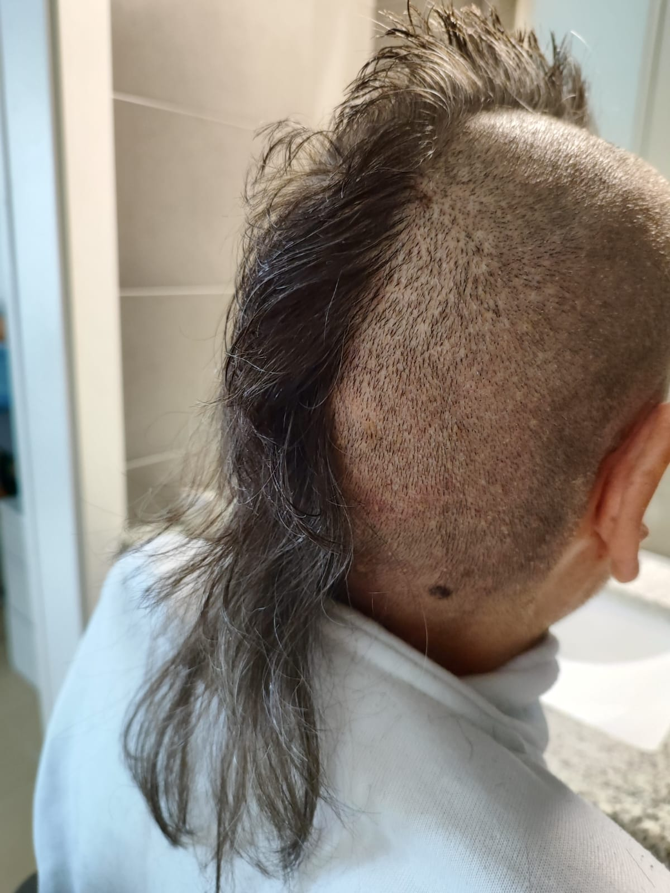

# 🚀 Guía de Optimización de Imágenes

Esta guía te ayudará a optimizar todas las imágenes de tu portfolio para mejorar el rendimiento y las métricas Core Web Vitals.

## 📋 Requisitos Previos

### 1. Instalar Homebrew (si no lo tienes)
```bash
/bin/bash -c "$(curl -fsSL https://raw.githubusercontent.com/Homebrew/install/HEAD/install.sh)"
```

### 2. Instalar herramientas de optimización
```bash
# Instalar todas las herramientas necesarias
brew install imagemagick webp libavif

# Verificar instalación
convert --version
cwebp -version
avifenc --version
```

## 🛠️ Ejecutar Optimización

### Opción 1: Usar el script automático
```bash
# Hacer el script ejecutable
chmod +x optimize-images.sh

# Ejecutar optimización
./optimize-images.sh
```

### Opción 2: Comandos manuales
```bash
# Crear directorio para imágenes optimizadas
mkdir -p images/optimizadas

# Convertir imágenes principales a WebP
cwebp -q 80 tu-foto-perfil.jpg -o images/optimizadas/tu-foto-perfil.webp
cwebp -q 80 freelancer-icon.png -o images/optimizadas/freelancer-icon.webp

# Convertir imágenes principales a AVIF  
convert tu-foto-perfil.jpg -quality 65 images/optimizadas/tu-foto-perfil.avif
convert freelancer-icon.png -quality 65 images/optimizadas/freelancer-icon.avif

# Convertir imágenes de proyectos
for img in images/proyectos/*.jpg; do
    filename=$(basename "$img" .jpg)
    cwebp -q 80 "$img" -o "images/optimizadas/${filename}.webp"
    convert "$img" -quality 65 "images/optimizadas/${filename}.avif"
done
```

## 📊 Beneficios Esperados

| Imagen | Tamaño Original | WebP (estimado) | AVIF (estimado) | Ahorro |
|--------|-----------------|-----------------|-----------------|--------|
| tu-foto-perfil.jpg | 183 KB | ~55 KB | ~37 KB | 80% |
| freelancer-icon.png | 6.3 KB | ~4 KB | ~3 KB | 50% |
| Imágenes proyectos | 25-35 KB c/u | ~8-12 KB | ~5-8 KB | 70% |

**Total estimado:** 300+ KB → 90 KB (70% de reducción)

## 🎯 Actualizar HTML para usar imágenes optimizadas

### Ejemplo para tu foto de perfil:
```html
<picture>
  <!-- AVIF - Mejor compresión, soporte moderno -->
  <source srcset="images/optimizadas/tu-foto-perfil.avif" type="image/avif">
  <!-- WebP - Buen soporte, excelente compresión -->
  <source srcset="images/optimizadas/tu-foto-perfil.webp" type="image/webp">
  <!-- Fallback JPEG para navegadores antiguos -->
  
</picture>
```

### Ejemplo para imágenes de proyectos:
```html
<picture>
  <source srcset="images/optimizadas/app-restaurante.avif" type="image/avif">
  <source srcset="images/optimizadas/app-restaurante.webp" type="image/webp">
  
</picture>
```

## ⚡ Mejoras de Rendimiento

### 1. **Lazy Loading Nativo**
```html

```

### 2. **Dimensiones explícitas**
```html

```

### 3. **Preload para imágenes críticas**
```html
<link rel="preload" href="images/optimizadas/tu-foto-perfil.avif" as="image" imagesrcset="images/optimizadas/tu-foto-perfil.avif 1x" imagesizes="50vw">
```

## 🎯 Impacto en Core Web Vitals

- **✅ LCP mejorado**: Imágenes más ligeras se cargan más rápido
- **✅ CLS reducido**: Dimensiones explícitas previenen layout shifts  
- **✅ FCP mejorado**: Menos datos que descargar para render inicial
- **✅ TTFB mejorado**: Menos carga en el servidor

## 🔍 Verificar Resultados

1. **Ejecuta el script de optimización**
2. **Verifica los tamaños de archivo**:
   ```bash
   ls -la images/optimizadas/*.webp images/optimizadas/*.avif
   ```

3. **Actualiza tu HTML** con los nuevos formatos
4. **Prueba en diferentes navegadores**
5. **Verifica en Google PageSpeed Insights**

## 📁 Estructura Final
```
images/
├── optimizadas/          # ← Nuevas imágenes optimizadas
│   ├── tu-foto-perfil.avif
│   ├── tu-foto-perfil.webp
│   ├── freelancer-icon.avif
│   ├── freelancer-icon.webp
│   ├── app-restaurante.avif
│   ├── app-restaurante.webp
│   └── ...
├── proyectos/            # ← Imágenes originales
│   ├── app-restaurante.jpg
│   └── ...
└── tu-foto-perfil.jpg   # ← Imágenes principales originales
```

## 🚀 Próximos Pasos

1. **Instalar las herramientas** con Homebrew
2. **Ejecutar el script** de optimización  
3. **Actualizar el HTML** con las nuevas imágenes
4. **Probar el rendimiento** con PageSpeed Insights
5. **Monitorizar** las métricas en Google Analytics

¡Tu sitio cargará significativamente más rápido! 🎉